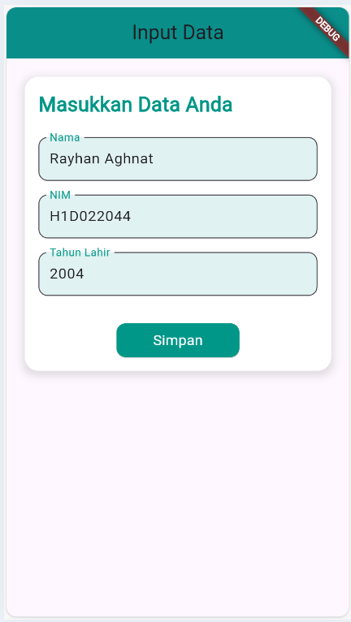
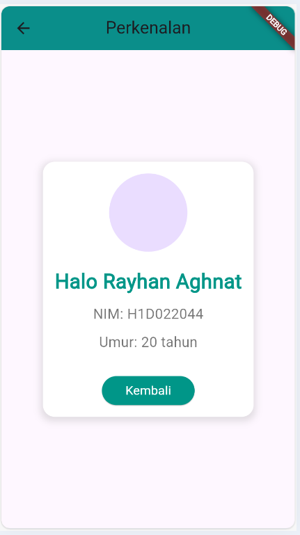

# Tugas Pertemuan 2

Fork dan clone repository ini, lalu jalankan perintah

```
flutter pub get
```

Buatlah tampilan form yang berisi nama, nim, dan tahun lahir pada file `ui/form_data.dart`, lalu buatlah tampilan hasil dari input data tersebut pada file `ui/tampil_data.dart`

JELASKAN PROSES PASSING DATA DARI FORM MENUJU TAMPILAN DENGAN FILE `README.md`

Buat tampilan semenarik mungkin untuk dilihat.

Nama : Rayhan Aghnat

NIM : H1D022044

Shift Baru: A

1. Tampilan Form
   Halaman form adalah tempat di mana pengguna memasukkan data seperti Nama, NIM, dan Tahun Lahir. Setelah data dimasukkan, pengguna akan menekan tombol Simpan untuk memproses dan mengirimkan data ke halaman berikutnya.

final \_namaController = TextEditingController();
final \_nimController = TextEditingController();
final \_tahunController = TextEditingController();

TextEditingController digunakan untuk mengontrol input pengguna pada masing-masing field. Dalam contoh ini, ada tiga controller untuk menangani input nama, NIM, dan tahun.

2. Navigasi Halaman
   Ketika tombol Simpan ditekan, kita menggunakan Navigator untuk melakukan navigasi ke halaman TampilData. Pada saat yang sama, data yang diisi di form akan dioper sebagai parameter ke halaman baru.
   Ketika tombol Simpan ditekan, nilai dari masing-masing TextEditingController diambil
   Setelah data terkumpul, Navigator.push digunakan untuk memindahkan pengguna ke halaman TampilData.

3. Tampilan Hasil
   Data yang dikirim dari halaman form (seperti nama, nim, dan tahun) akan diterima di sini sebagai parameter constructor. Masing-masing data akan masuk ke dalam variabel final (nama, nim, tahun).

## Screenshot

Contoh :


